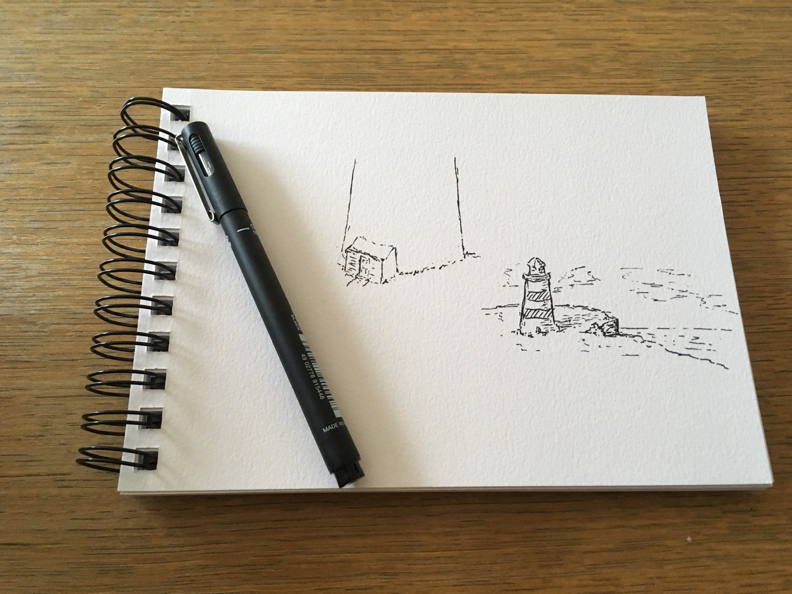
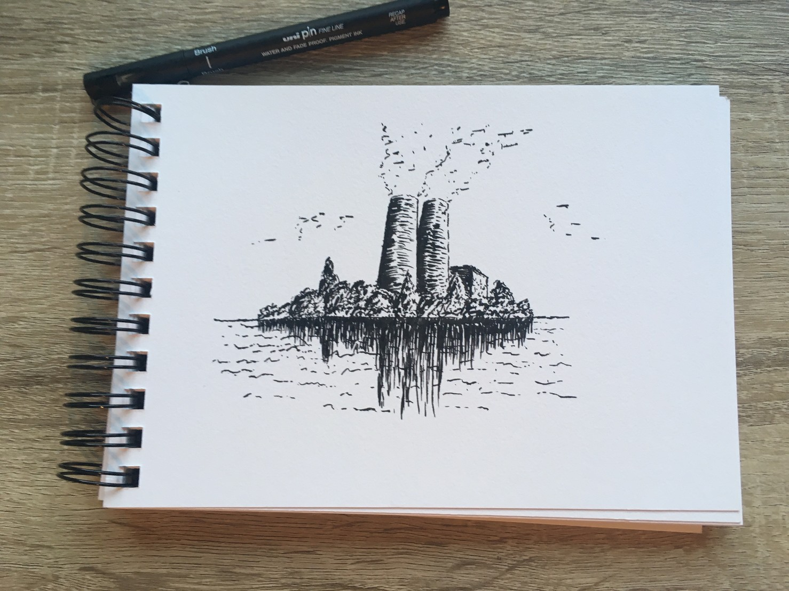
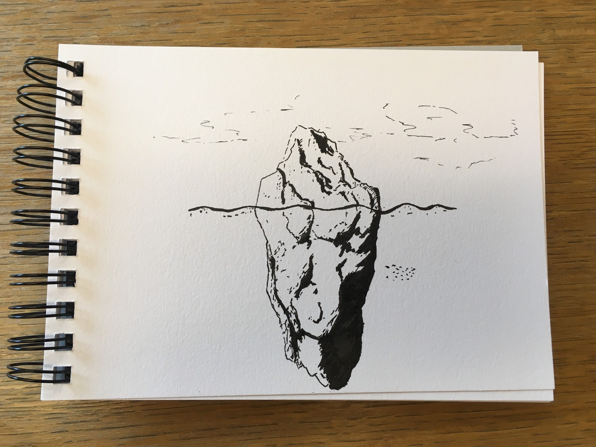
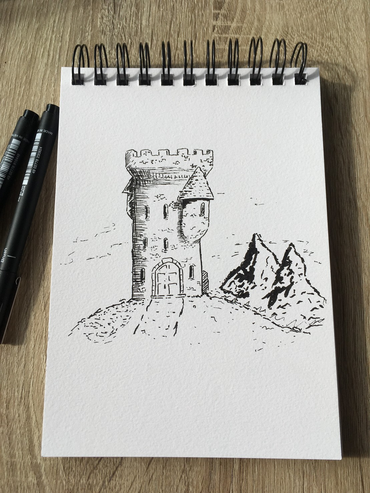
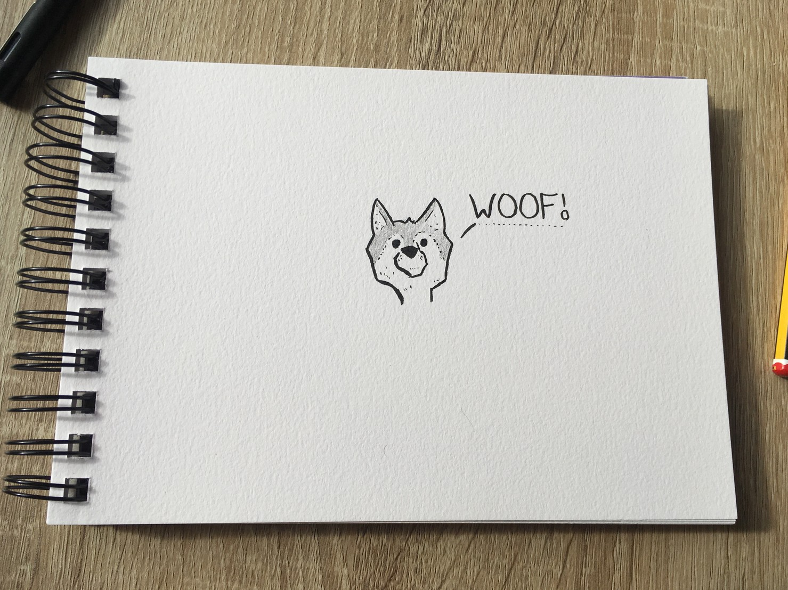
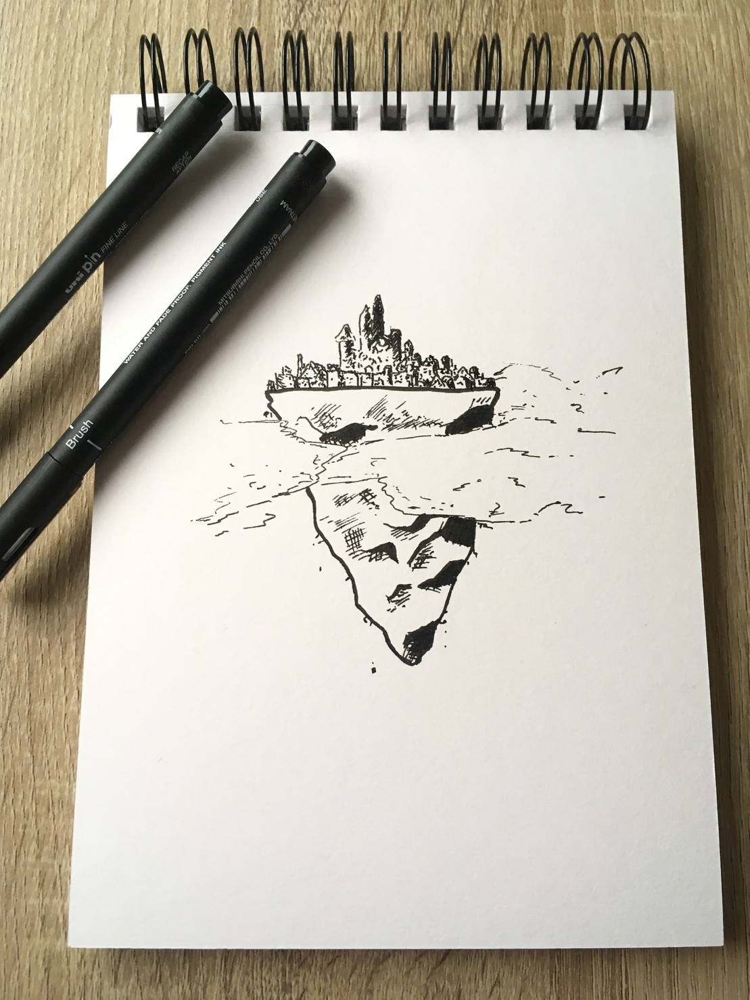
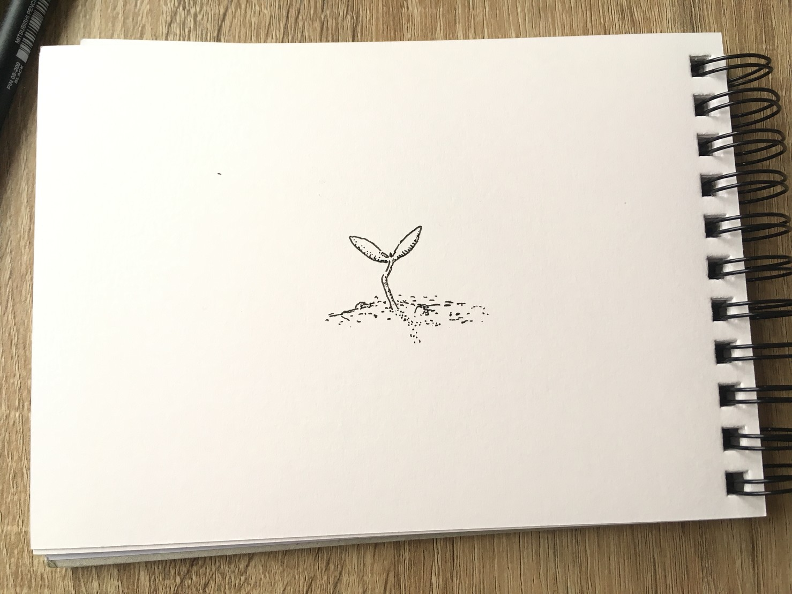

# inktober-2019
Doodles for inktober 2019

## Day 1 (Ring)

At night this lighthouse traces a ring of light around itself.

## Day 2 (Mindless)

There used to be fish in this lake untill the factory.

## Day 3 (Bait)

It seemed like a new bakery had opened in the woods.

## Day 4 (Frozen)

The sea ice didn't stay frozen as long as we thought it would.

## Day 5 (Build)

Somewhere in the mountains a wizard has built himself a tower.

## Day 6 (Husky)

Woof!

## Day 7 (Enchanted)

The city or Sparrow Pit took to the clouds to avoid war. Unfortunatley the wizards that put it there couldnt work out how to get it down before the clean water and food ran out.

## Day 8 (Frail)

Woof!

