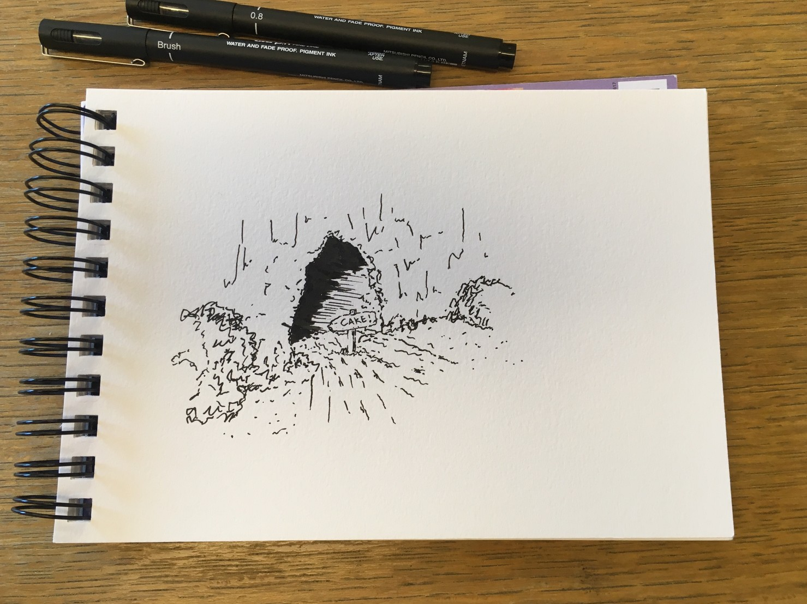
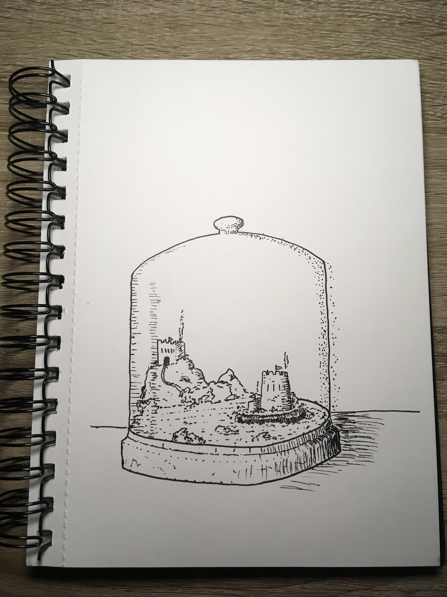

# inktober-2019
Doodles for inktober 2019

## Day 1 (Ring)

At night this lighthouse traces a ring of light around itself.

## Day 2 (Mindless)

There used to be fish in this lake untill the factory.

## Day 3 (Bait)

It seemed like a new bakery had opened in the woods.

## Day 4 (Frozen)

The sea ice didn't stay frozen as long as we thought it would.

## Day 5 (Build)

Somewhere in the mountains a wizard has built himself a tower.

## Day 6 (Husky)

Woof!

## Day 7 (Enchanted)

The city or Sparrow Pit took to the clouds to avoid war. Unfortunatley the wizards that put it there couldnt work out how to get it down before the clean water and food ran out.

## Day 8 (Frail)

Nothing had grown in years but slowly the first tentative steps of life returned.

## Day 9 (Swing)

The wizards favorite thinking tree had to be cut down, but they could not bear to lose their favorite swing too. It still hangs there today.

### Day 10 (Pattern)

Sometimes they just sat watching the shape of the reflections in the water of the lake.

## Day 11 (Snow)

In the winter we used to bw able to walk across the snow on the frozen lake.

## Day 12 (Dragon)

The locals say that a dragon lives beneath the mountain.

## Day 13 (Ash)

We sat and watched the fire die down to just ashes.

## Day 14 (Overgrown)

The towers of the okld empire were left to crumble.

## Day 15 (Legend)

Legend has it that the fairy king cast his sword into a toadstool deep in the woods after the magic wars.

## Day 16 (Wild)

The Dref are tiny creatures made of total darkness that live deepp in the forest.

## Day 17 (Ornament)

The wizard had had enough of two waring kings so shrank them and their castles down and sealed them in a bell jar to war alone. There has been peace ever since.

## Day 18 (Misfit)

Dorrit had never felt he belonged so they took to the sky in a boat of their own design

## Day 19 (Sling)

At night Dorrit would sleep in a hammock that they could sling over the side.

## Day 20 (Tread)

While out in the forest it is important to not tread on the home of the forest keeper.

## Day 21 (Treasure)

Deep in the forest there is an unassuming chest that contains the souls of anyone silly enough to open it.

## Day 22 (Ghost)

Sometimes the ghosts didnt wait untill dark to come out.

## Day 23 (Ancient)

Nobody knows who put them there, but they have been there as long as anyone can remember.

## Day 24 (Dizzy)

TOOT!

## Day 25 (Tasty)

When landed Dorrit made a sweet preserve out of the local plants to sustain themon the next ppart of the journey.

## Day 26 (Dark)

Who opened that door?

## Day 27 (Coat)

The Wizards cloak started moving all by itself. They had no idea where it got the scythe from but they were not going to ask as with went to go out the door.

## Day 28 (Ride)

Cowboy riding horse?

## Day 29 (Injured)

Dorrit was injured during the encounter with a wild Afnod.

## Day 30 (Catch)

Cricket ball.

